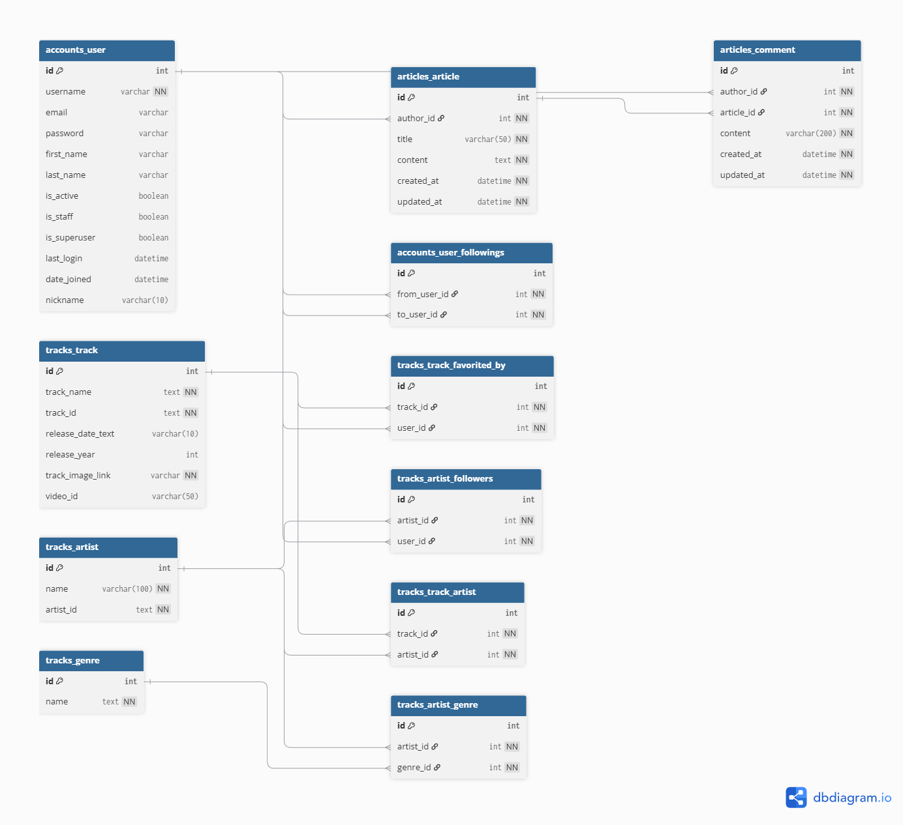

# Music Stack

1. **팀원 정보 및 업무 분담 내역**
  - 서울 4반 김민수 : 프론트엔드
  - 서울 4반 한상민 : 백엔드

2. **프로젝트 관리 (Git 활용)**
  - `branch` 생성 원칙 정리하기 (작업자 기능별)
    - 프론트엔드 브랜치 : minsu
    - 백엔드 브랜치 : sangmin
  - `commit` 내역 기록 원칙
    - 작업자 별로 commit을 하되, 한 번에 많은 양이 아닌 기능별로 나눠서 merge 진행

    | 타입 (Type) | 의미 |	사용 예시 |
    | --- | --- | --- |
    | feat | 새로운 기능 추가 |	feat: 로그인 기능 구현 |
    | fix	| 버그 수정 |	fix: 이메일 중복 체크 오류 수정 |
    | docs | 문서 수정 (README.md 등) |	docs: 설치 방법 설명 업데이트 |
    | style |	코드 포맷 변경 (세미콜론, 들여쓰기 등) |	style: lint 규칙에 맞춰 들여쓰기 수정 |
    | refactor | 코드 리팩토링 (기능은 그대로, 구조만 개선) |	refactor: 로그인 로직 함수 분리 |
    | test | 테스트 코드 추가 및 수정 |	test: 회원가입 유효성 검사 테스트 추가 |
    | chore |	빌드 업무, 패키지 매니저 설정 등 기타 작업 |	chore: lodash 라이브러리 추가 |

3. **목표 서비스 및 실제 구현 정도**
  - DRF를 활용해 *로그인* 및 *회원 가입* 기능 구현
  - 스포티파이 API를 활용해 *가수의 인기곡 TOP10 검색* 기능 구현
    - 좋아요를 눌러 마이페이지에 저장 기능 구현
  - 커뮤니티 CRUD 기능 구현
    - 게시글 CRUD 기능 구헌
      - 모든 유저는 본인의 게시글만 수정 및 삭제 가능
      - 게시글 생성 및 조회 기능 구현
      - 게시글 제목 옆에 댓글 수 표시 기능 구현
    - 댓글 CRUD 기능 구현
      - 모든 유저는 본인의 댓글만 수정 및 삭제 가능
      - 댓글 생성 및 조회 기능 구현
  - 유튜브 API를 활용해 *노래의 뮤직비디오* 시청 기능 구현
  - 마이페이지 기능 구현
    - 프로필 뮤직 설정 기능 구현
      - 유튜브 뮤직비디오 실행 가능
    - 좋아요한 노래 상세 페이지 구현
      - 노래 상세 페이지에서 뮤직비디오 실행 가능

4. **데이터베이스 모델링 (ERD)**

5. **추천 알고리즘에 대한 기술적 설명**
  - 사용자가 홈 화면에서 가수를 검색하면 스포티파이 API에 가수 이름을 보내고 그 가수에 대한 인기곡 10곡을 요청 받습니다.
  - 가수 노래 검색 결과에서는 4곡을 먼저 보여주고 사용자가 `다른 노래는 어때요?` 버튼을 누르면 추가로 4곡을 보여줍니다. 그 다음 `마지막 곡 보기` 버튼을 누르면 추가로 2개의 곡이 보여지며 사용자는 총 10개의 곡을 볼 수 있습니다.
  - 노래 검색 결과에서 각각의 노래를 `좋아요`할 수 있고, 좋아요한 노래는 프로필 페이지의 `좋아요한 노래` 목록에서 확인할 수 있으며 뮤직비디오 감상이 가능합니다.
  - (추천 기능 추가) : 좋아요한 곡이 10곡 이상이라면 AI추천 탭을 이용할 수 있습니다. 사용자가 좋아요한 노래를 바탕으로 AI가 새로운 노래를 추천해 줍니다.

6. **핵심 기능에 대한 설명**
  - 사용자가 입력한 가수 이름으로 스포티파이 API에 요청하고 가수의 `인기곡 10곡`을 받아옵니다. 그 인기곡을 바탕으로 사용자는 노래를 추천받을 수 있습니다.
  - 사용자는 추천받은 노래를 `좋아요`를 누를 수 있으며, 좋아요를 누른 노래는 마이페이지의 `좋아요한 노래 목록`에서 확인이 가능하고, 좋아요한 노래를 클릭하면 노래의 상세 페이지로 이동하며, `프로필 뮤직`을 설정하거나 `뮤직비디오`를 볼 수 있습니다.
  - 유튜브 API를 통해 노래의 뮤직비디오를 볼 수 있습니다. 사용자가 좋아요한 노래나 프로필 뮤직으로 설정한 노래의 뮤직비디오를 감상할 수 있습니다.
  - 커뮤니티 게시판을 통해 게시글과 댓글로 사용자간의 커뮤니케이션이 가능합니다
  - 별도의 AI 추천탭을 이용해 사용자는 좋아요한 곡이 10곡 이상이라면 그 노래를 바탕으로 새로운 노래를 추천받을 수 있습니다.

7. **생성형 AI를 활용한 부분**
  - 사용자가 홈 화면에서 가수를 검색하면 (예: 블랙핑크의 노래 추천해줘) OpenAI API의 GPT4-mini에 사용자 `input` 값을 가수 이름만 추출해서 스포티파이 API에 전달한다.
  - 좋아요한 노래가 10곡 이상이라면 그 노래들을 분석해서 비슷한 노래를 새롭게 추천해 줍니다.